<h1 align="center"> Oi , eu sou Lucas </h1>

  Estudante de Ciência da Computação | Desenvolvedor de software

---

### 🚀 Sobre mim

- 🎓 Graduando em Ciência da Computação
- 🧠 Aprofundando em arquitetura e engenharia de software
- 💻  foco no desenvolvimento front-end com HTML, CSS, JS, Angular, Next.js, e me especializando em back-end com Spring
- 🔭 Desenvolvendo projetos próprios como sistemas web, templates reutilizáveis e criação de APIs  
- 🚀 Buscando me tornar um arquiteto de software, criando soluções escaláveis, organizadas e de alto impacto

---

### 🛠️ Tecnologias e Ferramentas

#### ⚙️ Backend

#### 🌐 Frontend

#### 🗄️ Banco de Dados

#### ⚡ Ferramentas e Utilitários

### 🔧 Projetos em Destaque

| Projeto | Descrição | Tecnologias |
|--------|-----------|-------------|
| [📦 Portifólio pessoal](https://github.com/LucasBXavier/portifolioV2) | Portifólio próprio para exposição de projetos | HTML, CSS, JS, Bootstrap |
| [📬 Buscador de CEPs](https://github.com/LucasBXavier/busca-CEP) | Busca de endereços via API | HTML, CSS, JS, API Correios |
| [🧩 To-Do-List](https://github.com/LucasBXavier/ToDoList) | To-Do-List feita com API rest em Spring | Springboot, Lombok, Clean Code |
| [🏥 GastroInfo](https://github.com/LucasBXavier/GastroInfo) | Informativo de alergias, doenças e intolerancias gastrointestinais | HTML, CSS, JS, Bootstrap |
| [☁️ springCloud](https://github.com/LucasBXavier/springCloud) | Microsserviços com Spring Cloud | Springboot, Lombok, SpringCloud, Eureka, Feign, Rest Template,  Spring Cloud Gateway |

---

 ### 📊 GitHub Stats

  <!-- Stats Card -->
  <picture>
    <source srcset="./profile/stats-dark.svg" media="(prefers-color-scheme: dark)">
    <source srcset="./profile/stats-light.svg" media="(prefers-color-scheme: light)">
    
  </picture>

  <!-- Top Languages Card -->
  <picture>
    <source srcset="./profile/top-langs-dark.svg" media="(prefers-color-scheme: dark)">
    <source srcset="./profile/top-langs-light.svg" media="(prefers-color-scheme: light)">
    
  </picture>

---

### 🧭 Links Importantes

- 🌐 [Portfólio](https://lucasboareto.vercel.app)
- 💼 [LinkedIn](https://www.linkedin.com/in/lucas-boareto-6b3964216)
- 📫 E-mail: lucas_b.xavier@hotmail.com
