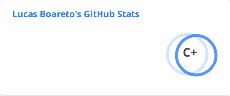
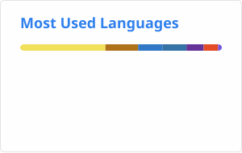

<h1 align="center"> Oi , eu sou Lucas </h1>

  <strong>Desenvolvedor Backend</strong> 
  Java • Spring Boot • APIs REST • Arquitetura de Software

---

## 🚀 Sobre mim

Sou desenvolvedor com foco em **Back-end Java e Spring**, atualmente graduando em Ciência da Computação.

Desde 2021 venho construindo projetos e explorando diferentes áreas do desenvolvimento, mas foi no back-end que encontrei meu principal interesse: **entender como transformar regras de negócio em sistemas organizados, confiáveis e fáceis de evoluir**.

No dia a dia, estudo e aplico conceitos como **Java, Spring Boot, APIs REST, SOLID, TDD, Clean Architecture, DDD e microsserviços**.

🎯 Meu objetivo é crescer como engenheiro de software e, no longo prazo, atuar com **arquitetura e desenho de soluções**.

💼 Estou aberto a oportunidades onde possa contribuir, aprender e trabalhar com pessoas que valorizem **qualidade de código, boas práticas e evolução contínua**.

---

### 🛠️ Tecnologias e Ferramentas

#### ⚙️ Backend

#### 🌐 Frontend

#### 🗄️ Banco de Dados

#### ⚡ Ferramentas e Utilitários

### 🔧 Projetos em Destaque

| Projeto | Descrição | Tecnologias |
|--------|-----------|-------------|
| [📦 Portifólio pessoal](https://github.com/LucasBXavier/portifolioV2) | Portifólio próprio para exposição de projetos | HTML, CSS, JS, Bootstrap |
| [📬 Buscador de CEPs](https://github.com/LucasBXavier/busca-CEP) | Busca de endereços via API | HTML, CSS, JS, API Correios |
| [🧩 To-Do-List](https://github.com/LucasBXavier/ToDoList) | To-Do-List feita com API rest em Spring | Springboot, Lombok, Clean Code |
| [🏥 GastroInfo](https://github.com/LucasBXavier/GastroInfo) | Informativo de alergias, doenças e intolerancias gastrointestinais | HTML, CSS, JS, Bootstrap |
| [☁️ springCloud](https://github.com/LucasBXavier/springCloud) | Microsserviços com Spring Cloud | Springboot, Lombok, SpringCloud, Eureka, Feign, Rest Template,  Spring Cloud Gateway |
| [🚗 MAINTORA](https://maintora.com.br) | Sistema de gerenciamento de oficinas | Springboot, Spring security, Lombok, postgreSQL, next.js |
| [🍟 Sabor & Pote](https://lucasbxavier.github.io/sistemaFood-landing/) | sistema de controle de custos, receitas, vendas e lucro | next.js, postgreSQL, supabase |

---

 ### 📊 GitHub Stats

  <!-- Stats Card -->
  <!-- <picture>
    <source media="(prefers-color-scheme: dark)" srcset="./profile/stats-dark.svg">
    
  </picture> -->

  <!-- Top Languages Card -->
  <picture>
    <source media="(prefers-color-scheme: dark)" srcset="./profile/top-langs-dark.svg">
    
  </picture>

---

### 🧭 Links Importantes

  
  &nbsp;&nbsp;&nbsp;
  
  &nbsp;&nbsp;&nbsp;
  

